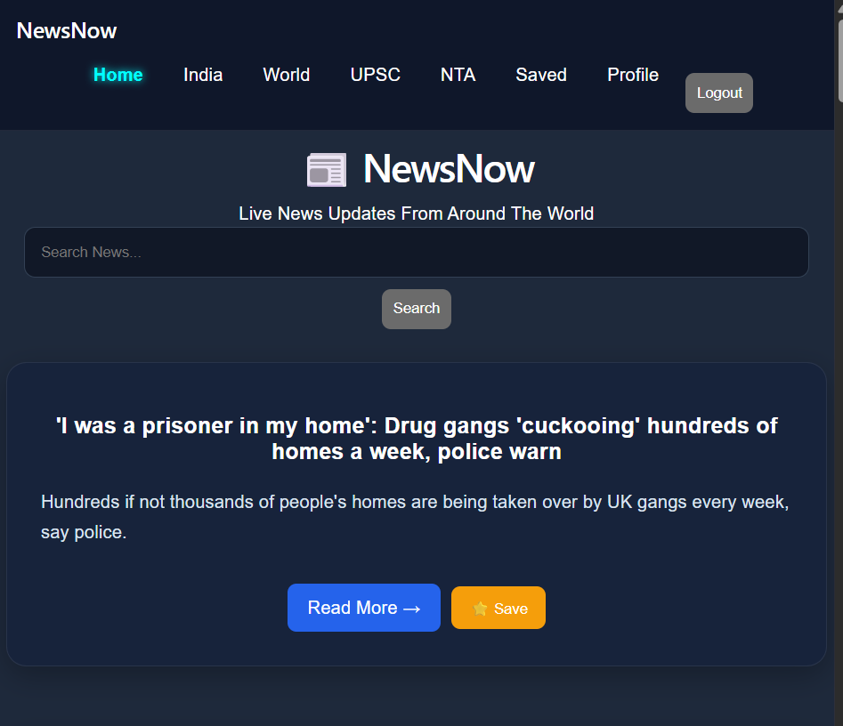
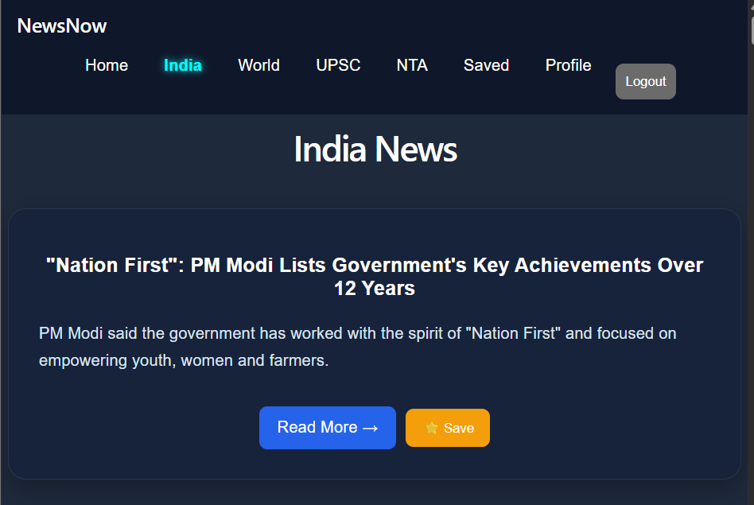

# 📰 NewsNow

NewsNow is a full-stack news aggregation platform that delivers live news updates from multiple RSS sources. Users can explore category-based news, search articles, create accounts, and save bookmarks for later reading.

## 🚀 Live Demo

https://newsnow-7oq1.vercel.app

## 📸 Screenshots

### Home Page

### India News

### Login Page

## ✨ Features

* Live news aggregation using RSS feeds
* Category-wise news browsing

  * India
  * World
  * UPSC
  * NTA
* Search news articles
* User authentication (Register/Login)
* Save and manage bookmarks
* Responsive design
* Automatic news updates

## 🛠 Tech Stack

### Frontend

* React.js
* React Router
* CSS3

### Backend

* Node.js
* Express.js

### Database

* MongoDB

### Authentication

* JWT (JSON Web Tokens)

### News Sources

* RSS Feeds
* RSS Parser

### Deployment

* Render

## 🏗 Project Architecture

Frontend (React)
↓
REST APIs (Express)
↓
RSS Aggregation Layer
↓
MongoDB Database

## 📂 Folder Structure

client/
├── src/
│ ├── pages/
│ ├── components/
│ ├── services/
│ └── App.jsx

server/
├── routes/
├── middleware/
├── models/
└── server.js

## ⚙️ Installation

Clone the repository:

git clone https://github.com/yourusername/newsnow.git

Install dependencies:

cd client
npm install

cd ../server
npm install

Start frontend:

npm run dev

Start backend:

npm start

## 🔐 Environment Variables

Create a .env file:

MONGO_URI=your_mongodb_uri

JWT_SECRET=your_secret_key

## 🎯 Future Improvements

* AI-powered article summaries
* Dark/Light mode
* Trending news section
* Personalized recommendations
* Multi-language support

## 👩‍💻 Author

Ashmita Chaturvedi

GitHub: https://github.com/yourusername
