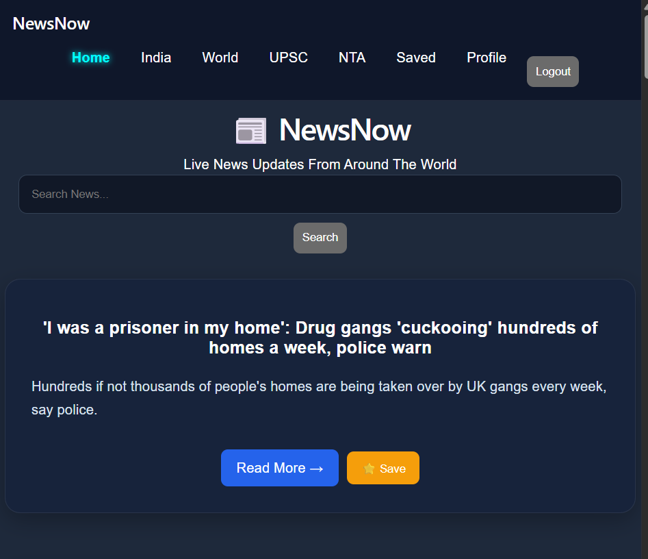
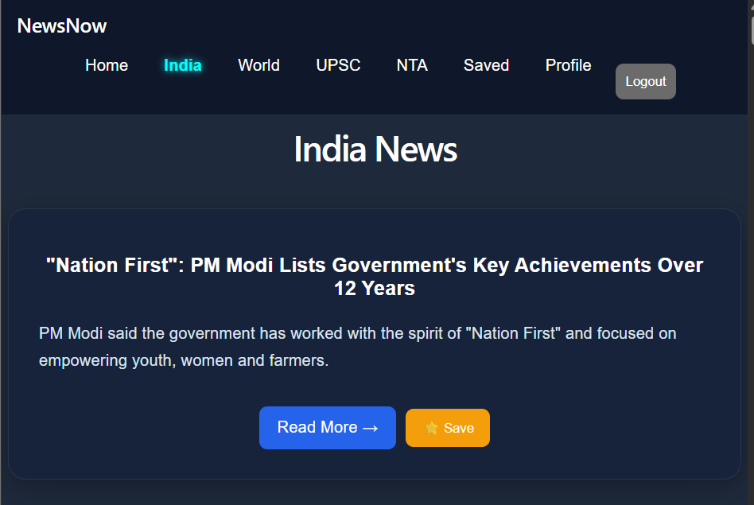
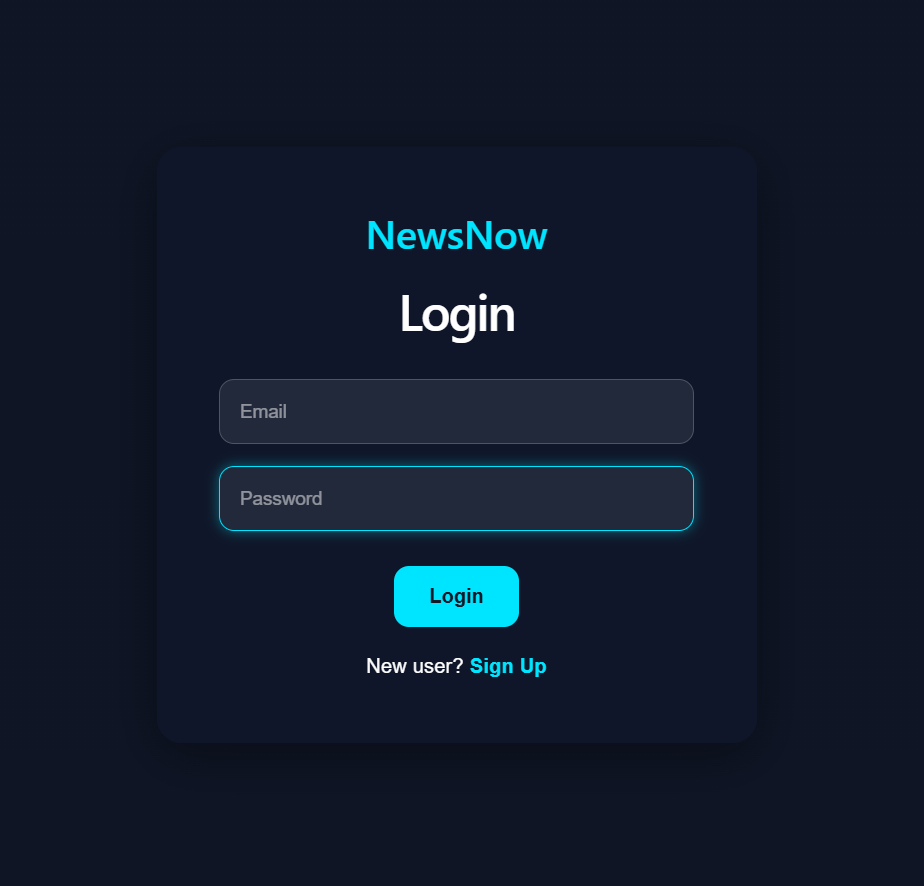
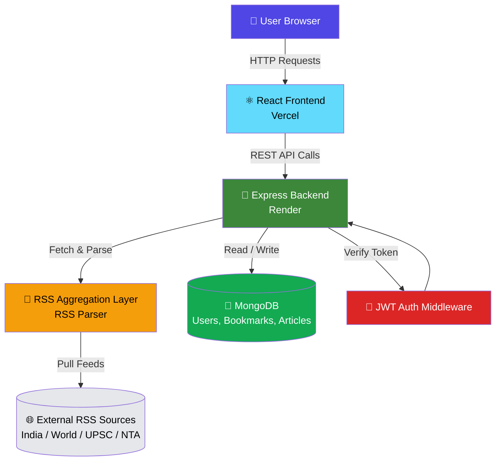
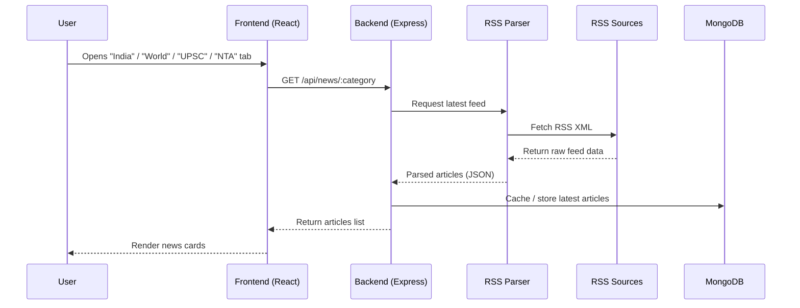
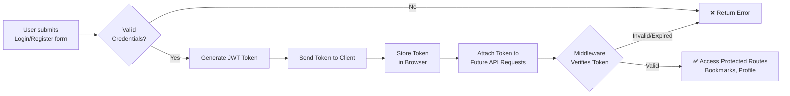
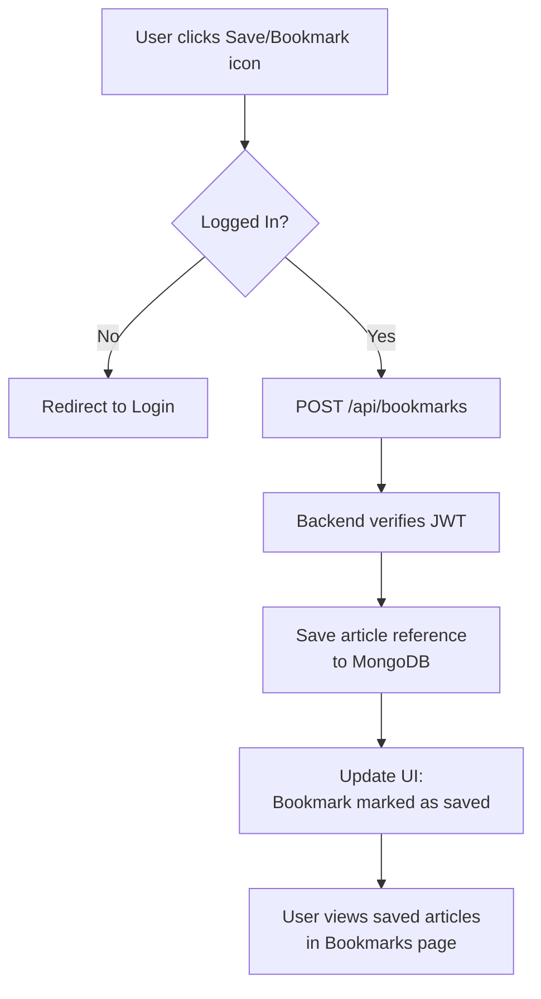
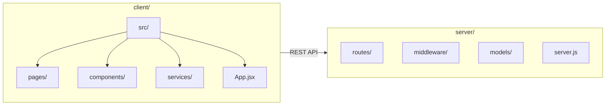

# 📰 NewsNow

NewsNow is a full-stack news aggregation platform that delivers live news updates from multiple RSS sources. Users can explore category-based news, search articles, create accounts, and save bookmarks for later reading.

## 🚀 Live Demo

[🚀 Open NewsNow](https://newsnow-7oq1.vercel.app)

## 📸 Screenshots

### Home Page


### India News


### Login Page


## ✨ Features

* Live news aggregation using RSS feeds
* Category-wise news browsing
  * India
  * World
  * UPSC
  * NTA
* Search news articles
* User authentication (Register/Login)
* Save and manage bookmarks
* Responsive design
* Automatic news updates

## 🛠 Tech Stack

### Frontend
* React.js
* React Router
* CSS3

### Backend
* Node.js
* Express.js

### Database
* MongoDB

### Authentication
* JWT (JSON Web Tokens)

### News Sources
* RSS Feeds
* RSS Parser

### Deployment
* Render (Backend) + Vercel (Frontend)

## 🏗 Project Architecture


```mermaid
flowchart TD
    A[👤 User Browser] -->|HTTP Requests| B[⚛️ React Frontend<br/>Vercel]
    B -->|REST API Calls| C[🚂 Express Backend<br/>Render]
    C -->|Fetch & Parse| D[📡 RSS Aggregation Layer<br/>RSS Parser]
    D -->|Pull Feeds| E[(🌐 External RSS Sources<br/>India / World / UPSC / NTA)]
    C -->|Read / Write| F[(🍃 MongoDB<br/>Users, Bookmarks, Articles)]
    C -->|Verify Token| G[🔐 JWT Auth Middleware]
    G --> C

    style A fill:#4f46e5,color:#fff
    style B fill:#61dafb,color:#000
    style C fill:#3c873a,color:#fff
    style D fill:#f59e0b,color:#000
    style E fill:#e5e7eb,color:#000
    style F fill:#13aa52,color:#fff
    style G fill:#dc2626,color:#fff
```

## 🔄 How News Aggregation Works


```mermaid
sequenceDiagram
    participant U as User
    participant F as Frontend (React)
    participant B as Backend (Express)
    participant R as RSS Parser
    participant S as RSS Sources
    participant D as MongoDB

    U->>F: Opens "India" / "World" / "UPSC" / "NTA" tab
    F->>B: GET /api/news/:category
    B->>R: Request latest feed
    R->>S: Fetch RSS XML
    S-->>R: Return raw feed data
    R-->>B: Parsed articles (JSON)
    B->>D: Cache / store latest articles
    B-->>F: Return articles list
    F-->>U: Render news cards
```

## 🔐 Authentication Flow


```mermaid
flowchart LR
    A[User submits<br/>Login/Register form] --> B{Valid<br/>Credentials?}
    B -- No --> C[❌ Return Error]
    B -- Yes --> D[Generate JWT Token]
    D --> E[Send Token to Client]
    E --> F[Store Token<br/>in Browser]
    F --> G[Attach Token to<br/>Future API Requests]
    G --> H{Middleware<br/>Verifies Token}
    H -- Valid --> I[✅ Access Protected Routes<br/>Bookmarks, Profile]
    H -- Invalid/Expired --> C
```

## 🔖 Bookmark Flow


```mermaid
flowchart TD
    A[User clicks Save/Bookmark icon] --> B{Logged In?}
    B -- No --> C[Redirect to Login]
    B -- Yes --> D[POST /api/bookmarks]
    D --> E[Backend verifies JWT]
    E --> F[Save article reference<br/>to MongoDB]
    F --> G[Update UI:<br/>Bookmark marked as saved]
    G --> H[User views saved articles<br/>in Bookmarks page]
```

## 📂 Folder Structure


```mermaid
flowchart LR
    subgraph Client["client/"]
        direction TB
        C1[src/]
        C2[pages/]
        C3[components/]
        C4[services/]
        C5[App.jsx]
        C1 --> C2
        C1 --> C3
        C1 --> C4
        C1 --> C5
    end

    subgraph Server["server/"]
        direction TB
        S1[routes/]
        S2[middleware/]
        S3[models/]
        S4[server.js]
    end

    Client -- REST API --> Server
```

<details>
<summary>📁 Plain text folder structure (click to expand)</summary>

```
client/
├── src/
│   ├── pages/
│   ├── components/
│   ├── services/
│   └── App.jsx
server/
├── routes/
├── middleware/
├── models/
└── server.js
```

</details>

## ⚙️ Installation

Clone the repository:

```bash
git clone https://github.com/ashmitachaturvedi/newsnow.git
```

Install dependencies:

```bash
cd client
npm install
cd ../server
npm install
```

Start frontend:

```bash
npm run dev
```

Start backend:

```bash
npm start
```

## 🔐 Environment Variables

Create a `.env` file in `server/`:

```
MONGO_URI=your_mongodb_uri
JWT_SECRET=your_secret_key
```

## 🎯 Future Improvements

* [ ] AI-powered article summaries
* [ ] Dark/Light mode
* [ ] Trending news section
* [ ] Personalized recommendations
* [ ] Multi-language support

## 👩‍💻 Author

**Ashmita Chaturvedi**
GitHub: [ashmitachaturvedi](https://github.com/ashmitachaturvedi)
